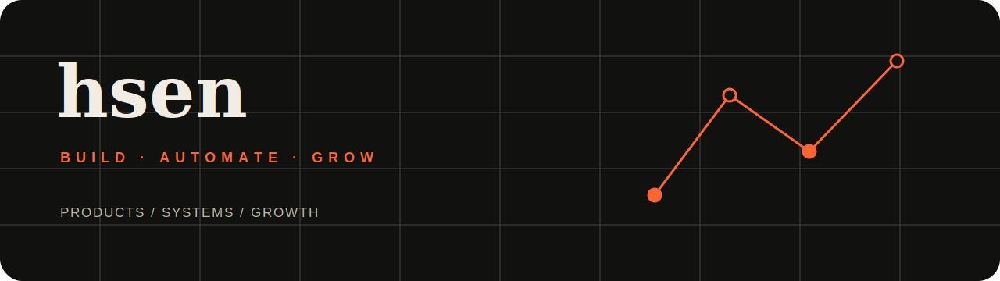
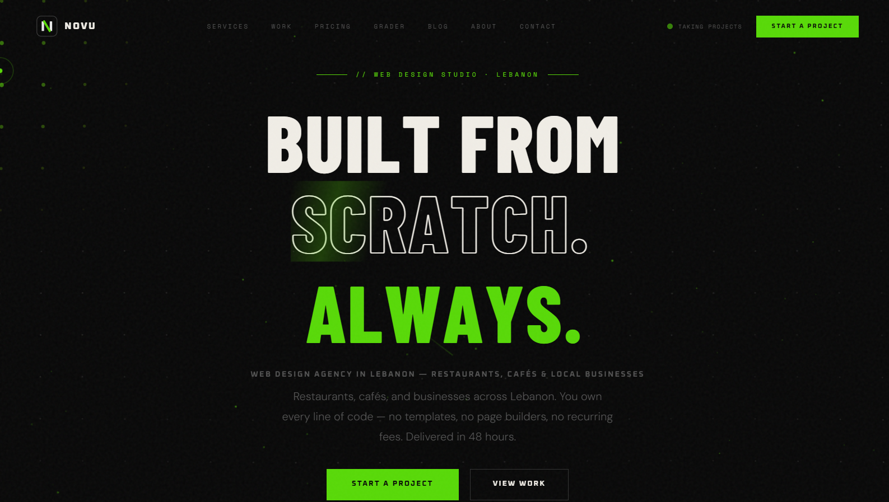
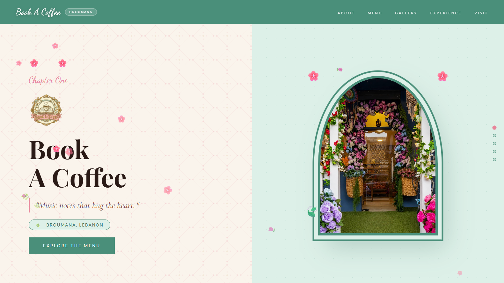
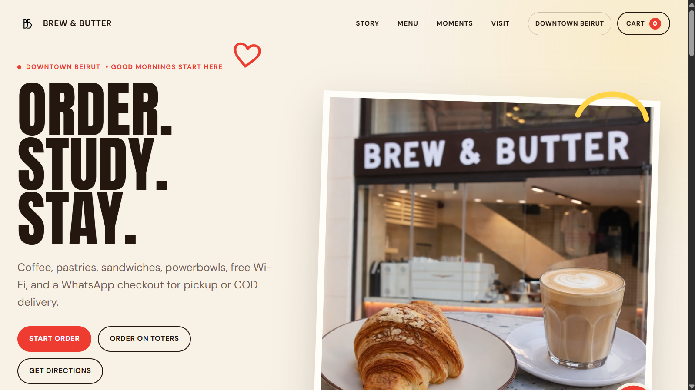
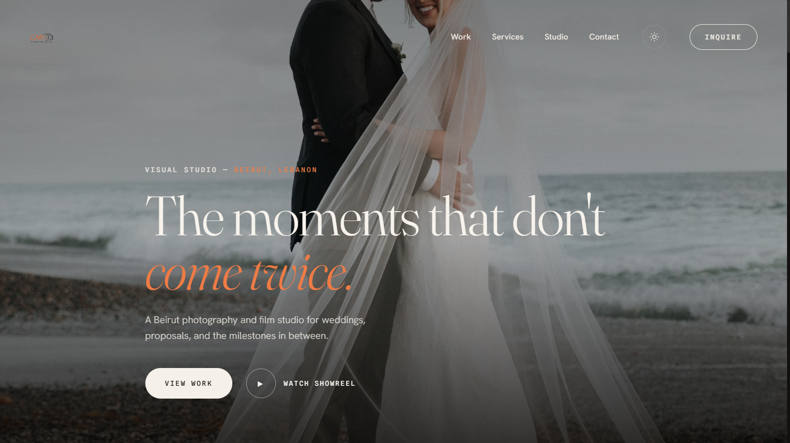
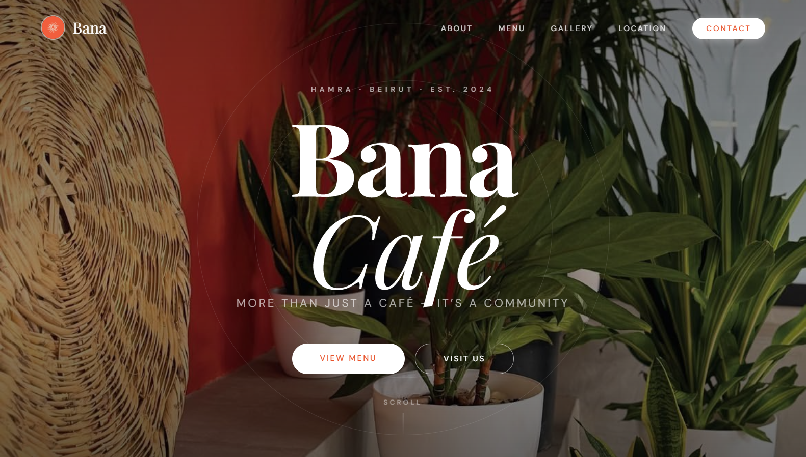

  

<h1 align="center">hsen</h1>

<strong>Hsen Hmede</strong> · Computer Science & Mathematics · Founder of Novu Studios · Lebanon

I build products, automation systems, and growth tools—and I take them from an idea to something people can actually use. Through **Novu Studios**, I handle client discovery, design, development, deployment, and iteration.

### Product engineering

Responsive websites, digital menus, interactive interfaces, deployment

### AI & automation

Lead research, personalized demo generation, structured outreach workflows

### Business & growth

Client delivery, Meta campaigns, sales systems, ongoing maintenance

## Novu Studios

**[Novu V2](https://novustudios.com)** is my main studio website and the home of my client work. Novu focuses on fast, distinctive digital experiences for hospitality and service businesses.

[Website](https://novustudios.com) · [Studio Instagram](https://instagram.com/studiosnovu)

## Selected work

### [Novu V2](https://novustudios.com)

Main studio website for positioning, project discovery, and client acquisition.

### [Book A Coffee](https://bookacoffee.com)

Production website for a multi-branch bookshop café in Broumana and Batroun.

### [Brew & Butter](https://github.com/hsen308/brew-and-butter)

Multi-location café website with ordering paths, local-business data, and responsive UX.

### [CAPO Production](https://github.com/hsen308/capo)

Editorial photography and film portfolio with responsive layouts and light/dark themes.

### [Bana Café](https://github.com/hsen308/bana-cafe)

Interactive café concept combining visual identity, motion, and responsive implementation.

### [AI Lead-Generation Pipeline](https://github.com/hsen308/ai-lead-generation-pipeline)

Sanitized architecture case study for automated lead research, personalized demo generation, and assisted outreach.

## Tools I use

`HTML` · `CSS` · `JavaScript` · `Python` · `C/C++` · `GSAP` · `Responsive design` · `GitHub Pages` · `Vercel` · `AI-assisted workflows` · `Meta Ads`

## Current focus

- Studying Computer Science & Mathematics at Lebanese University
- Shipping client work through Novu Studios
- Building automation systems that connect research, content generation, and outreach

## Contact

[Personal Instagram](https://instagram.com/hsenn_hmede) · [Novu Studios](https://novustudios.com) · [Studio Instagram](https://instagram.com/studiosnovu)
